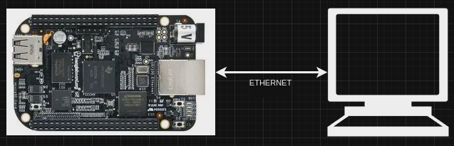

# Network Setup Between PC and BeagleBone Black

This guide outlines the steps to establish a direct network connection between your PC and the BeagleBone Black using an Ethernet cable and configuring static IP addresses on both devices.

## A. Physical Connection

1. **Connect the Ethernet Cable**: Plug one end of the Ethernet cable into the Ethernet port on the BeagleBone Black and the other end into your PC's Ethernet port.




## B. Configure Static IP Addresses

### BeagleBone Black Configuration:

To set a static IP address on the BeagleBone Black, you may either edit the network configuration files directly or use command-line tools.

- **Editing `/etc/network/interfaces`**:

  1. Access your BeagleBone Black via SSH or a serial console.
  2. Edit the `/etc/network/interfaces` file with a text editor (e.g., nano, vi).
  3. Modify the section for your Ethernet interface (usually `eth0`) as follows:

     ```
     auto eth0
     iface eth0 inet static
         address 192.168.1.2
         netmask 255.255.255.0
         gateway 192.168.1.1
     ```

  4. Replace `192.168.1.2` with the desired IP address for your BeagleBone Black. Adjust the `netmask` and `gateway` as necessary.
  5. Save your changes and `restart` the network service or reboot the device.

### PC Configuration:

The process to set a static IP address on your PC depends on the operating system you are using.

- **On Linux**:
  - You can use `nmcli` or manually edit network configuration files like `/etc/network/interfaces`, depending on your distribution.

  **Example using `nmcli`**:

  ```bash
  nmcli con mod "Wired connection 1" ipv4.method manual ipv4.addresses "192.168.1.1/24" ipv4.gateway ""
  nmcli con up "Wired connection 1"
  ```

  Replace `"Wired connection 1"` with your connection's name and adjust the IP address accordingly.

## C. Test the Connection

Once both devices have been configured with static IP addresses, perform the following tests:

1. **Ping Test**: From your PC, use a terminal or command prompt to ping the BeagleBone Black.

   ```bash
   ping 192.168.1.2
   ```

   Successful replies indicate a good connection.

2. **SSH Test** (optional): If SSH is enabled on your BeagleBone Black, try to SSH into it from your PC.

   ```bash
   ssh root@192.168.1.2
   ```

   Replace `root` with the appropriate username for your BeagleBone Black setup.

If you encounter issues, ensure both devices are configured correctly, the Ethernet cable is functioning, and both devices are on the same subnet.
