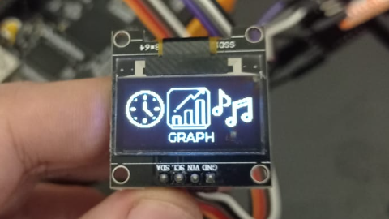
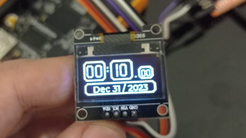
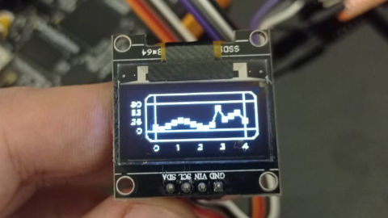
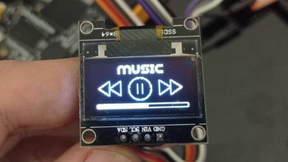
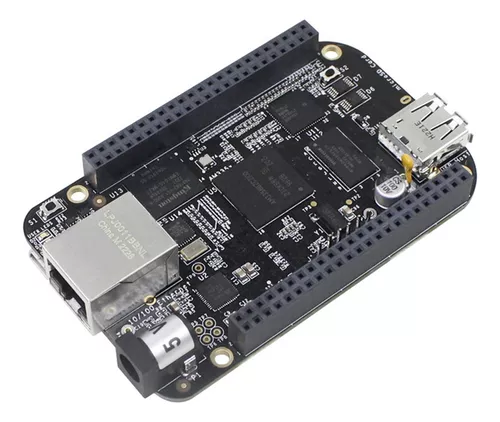

# LVGL with SSD1306 on BeagleBone

This project aims to integrate a graphical user interface (GUI) created with LVGL (Light and Versatile Graphics Library) displayed on an SSD1306 OLED screen, controlled by a BeagleBone board. The project will demonstrate the process of setting up a Yocto-based Linux image, integrating LVGL, interfacing with the SSD1306 OLED display, and creating a simple yet interactive GUI application.









## Project Objectives

- To build a custom Linux image using Yocto Project for BeagleBone.
- To integrate LVGL for creating GUI applications.
- To develop a driver or interface mechanism for communicating between LVGL and the SSD1306 OLED screen.
- To create a simple GUI application as a demonstration.

## Prerequisites

- BeagleBone Board (any variant compatible with Yocto Project)
- SSD1306 OLED Display (128x64 pixels, I2C interface)
- Basic knowledge of the C programming language
- Familiarity with Linux, especially command-line tools and the Yocto Project
- Access to a Linux development environment for running Yocto builds

## Step 1: Setting Up the Yocto Project Environment

1. Clone the Poky repository from the Yocto Project:

    ```bash
    cd yocto/sources
    git clone -b nanbield git://git.yoctoproject.org/poky.git my-nanbield
    ```

2. Initialize the Yocto build environment:

    ```bash
    
    source sources/poky/oe-init-build-env build
    ```

3. Configure the build for BeagleBone by editing `conf/local.conf` and `conf/bblayers.conf` as necessary.

## Step 2: Adding Necessary Layers

- Include `meta-openembedded`,and `meta-custom` layers to your build environment.
- Customize `conf/bblayers.conf` to include these layers.


## Step 3: Building and Testing

- Compile your GUI application along with LVGL for the BeagleBone.
- Deploy the application to your BeagleBone and test the GUI on the SSD1306 display.

To complement your README with information about the recipes available in your repository under `meta-custom`, and to provide references to the kernel driver and user space application repositories, you could structure an additional section as follows. This structure also acknowledges the use of the `ssd1306.dtsi` file, the utilization of code generated by SquareLine Studio, and specifies the version of LVGL used:

---

## Repository Structure and External Resources

This project includes a set of Yocto recipes organized under the `meta-custom` layer, which facilitates the integration of LVGL with the SSD1306 OLED display on the BeagleBone platform. Below is an overview of the key recipes and components available within this layer:

### `meta-custom` Recipes

- **LVGL and SSD1306 Integration**: Provides the recipes necessary for building and integrating LVGL with the SSD1306 driver, enabling the creation of GUI applications for the OLED display.
    - `lvgl-ssd1306`: Contains the LVGL application recipe, including drivers and necessary files.
    - `ssd1306-tool`: A recipe for the user-space tool to test the SSD1306 OLED display functionality.
- **SSD1306 OLED Driver**: Facilitates communication with the SSD1306 OLED screen via a kernel driver.
    - `ssd1306-driver`: The kernel driver recipe for the SSD1306 OLED display.

### External Resources

- **SSD1306 Linux Kernel Driver**: The kernel driver for the SSD1306 OLED display is available at [this GitHub repository](https://github.com/bdcabreran/ssd1306-linux). This driver is essential for low-level communication with the display hardware.
- **SSD1306 Tool**: A user-space application for testing the SSD1306 OLED display can be found at [this GitHub repository](https://github.com/bdcabreran/ssd1306-tool). It provides a convenient way to verify the display's functionality.

### Additional Notes

- **Device Tree Support**: The project includes a `ssd1306.dtsi` file, defining the driver's device tree structure, ensuring seamless integration with the Linux kernel.
- **LVGL Version**: This project utilizes LVGL version 8.3, a Light and Versatile Graphics Library, for creating the GUI application.
- **Code Generation**: The LVGL application leverages code generated by SquareLine Studio, enhancing the development process by providing a visual interface to design and integrate the GUI elements efficiently.

By providing a comprehensive overview of the project's structure, resources, and external references, this section aims to facilitate a deeper understanding and easier navigation for contributors and users interested in exploring the integration of LVGL with the SSD1306 display on the BeagleBone platform.


## License

This project is licensed under the MIT License - see the [LICENSE.md](LICENSE.md) file for details.

## Demonstrations

Here is a video demonstration the LVGL application :


- **Main Aplication**: Check out the tool in action, displaying some screen animations on the SSD1306 OLED display:.

    [](https://www.youtube.com/watch?v=eBT-ndjLSQg&ab_channel=BayronCabrera)

## Author

**Bayron Cabrera**

- **GitHub:** https://github.com/bdcabreran
- **LinkedIn:** https://www.linkedin.com/in/bayron-cabrera-517821124/
- **Email:** bayron.nanez@gmail.com

